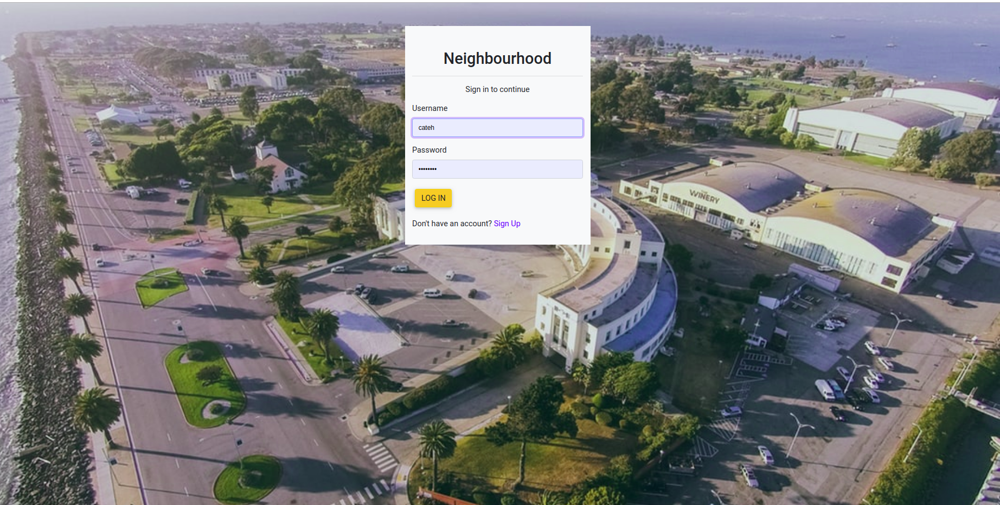
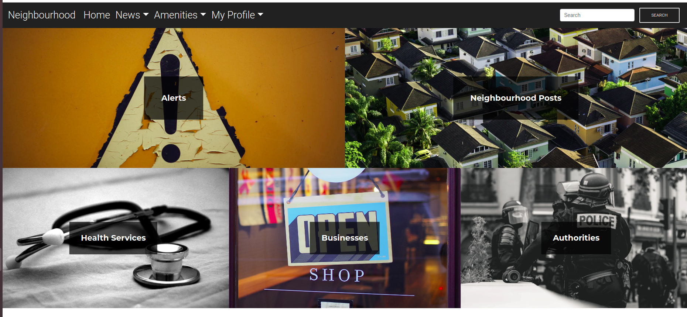

## PROJECT NAME 
- NEIGHBOURHOOD

## AUTHOR 
- kitili

## DESCRIPTION 
- This is a web application allows you to be in the loop about everything happening in your neighborhood. From  meeting announcements to even alerts.

## Features

As a user of the web application you will be able to:

1. Sign up and log in

2. Choose your neighbourhood
3. View  posted alerts and post by other users from your neighbourhood
4. Post alerts and posts
5. Comment on a post
6. Edit your profile
7. See authorities and health services around

## BDD 

## Specifications
| Behavior            | Input                         | Output                        | 
| ------------------- | ----------------------------- | ----------------------------- |
| User visits the app and gets directed to the login page  | User logs in | Directed to the home page | 
If user has no account, they click on `sign up` | User signs up | User is redirected to the profile set up page |
|  Homepage loads | Click `alerts` | User's taken to the alerts page| 
| Homepage loads | Click `Neighbourhood Posts` | User's redirected to a page where they can see uploaded posts and a button to post too | 
| Homepage loads | Click `Health Services` | User's redirected to a page where they can see health services | 
| Homepage loads | Click `Businesses` | User's redirected to a page where they can see uploaded businesses |
| Homepage loads | Click `Authorities` | User's redirected to a page where they can see posted authorities in the same neighbourhood |
| Homepage loads | User inputs in the search form and presses enter | Searched results show |

## SETUP AND INSTALLATION 
### Prerequisites
* python3
* virtual environment
* pip

### Cloning
* In your terminal:
        
        $ git clone https://github.com/kitili/Neighbourhood.git
        $ cd neighbourhood

## Running the Application
* Install virtual environment using `$ python3.6 -m venv --without-pip virtual`
* Activate virtual environment using `$ source virtual/bin/activate`
* Download pip in our environment using `$ curl https://bootstrap.pypa.io/get-pip.py | python`
* Install all the dependencies from the requirements.txt file by running `python3.6 pip install -r requirements.txt`
* Create a database and edit the database configurations in `settings.py` to your own credentials.
* Make migrations

        $ python3 manage.py makemigrations watch
        $ python3 manage.py migrate 

* To run the application, in your terminal:

        $ python3 manage.py runserver

## Technologies Used
* Python3
* Django
* HTML
* Bootstrap

This application is developed using [Python3.6](https://www.python.org/doc/), [Django](https://www.djangoproject.com/), [HTML](https://getbootstrap.com/) and [Bootstrap](https://getbootstrap.com/)

## Contacts
**moourinekitilimourine@gmail.com**

## live link 

https://mucie.herokuapp.com/

## License
This project is licensed under the MIT License - see the [LICENSE.md](LICENSE.md) file for details

# neighbourhood
